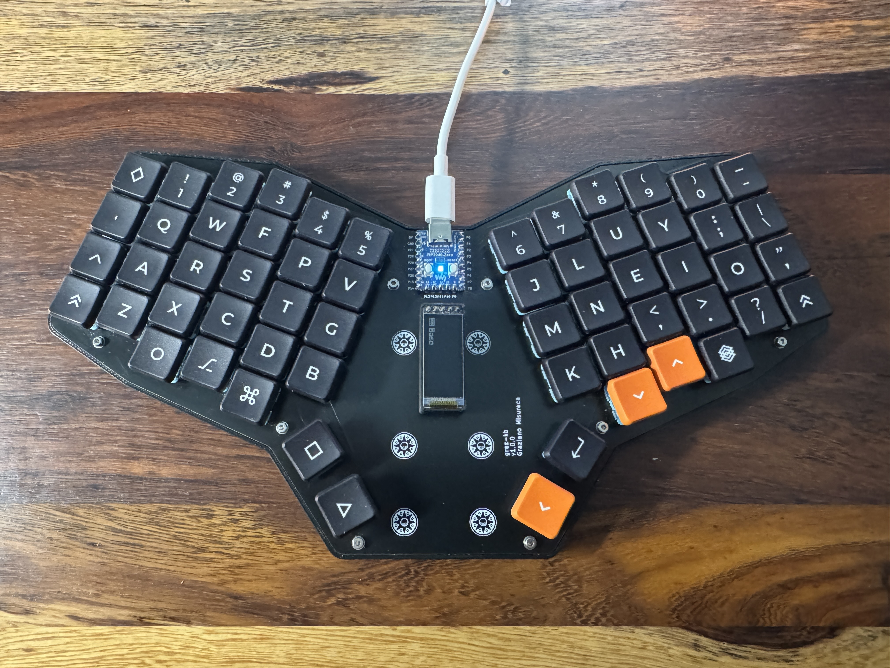

# Graziano's keyboard

[ZMK configuration and keymap](https://github.com/Grazfather/zmk-config-grazkb)

## Requirements
* ~58 keys
* Full number row and alphabet
* At least cmd and opt keys somewhere
* 2 thumb keys per side

## Resources
### Videos
* https://www.youtube.com/watch?v=M_VuXVErD6E - Design Your Own Keyboard! (ergogen + Kicad)
* https://www.youtube.com/watch?v=8WXpGTIbxlQ - How to Design Mechanical Keyboard PCBs with Kicad (Scotto libraries)
* https://www.youtube.com/watch?v=iv__343ZwE0 - How do Design a Custom Mechanical Keyboard (printed case, handwired)
* https://www.youtube.com/watch?v=hkSad4n76Lc Top fifteen Mistakes People Make When Designing Prototype PCBs
  * Make big, lots of space
  * Add test points
  * use silkscreen to add pinouts and stuff
  * Add LEDs
  * Add isolation jumpers
  * Breakout unused GPIOs so you can use for debugging, rerouting, or adding
  * Add i2c address straps you can short
  * Order labeled parts
  * Verify footprints - Use measuring tools
  * Consider part availability
### Tutorials
* https://flatfootfox.com/ergogen-introduction/ - Great guide

### Tools
* Ergogen
* Keyboard layout editor http://www.keyboard-layout-editor.com/#/
* Keyboard Plate Generator https://plate.keeb.io/
* Plate and case builder http://builder.swillkb.com/

## Parts
* OLED display
  * https://42keebs.eu/shop/parts/oled-display-0-91-128x32/ - $4
  * https://www.littlekeyboards.com/collections/oled-screens/products/oled-screen - $6
* Microcontroller
  * Pro Micro w/USB c - https://42keebs.eu/shop/parts/controllers/pro-micro-usb-c-controller/
  * RP2040 with pro micro footprint - https://42keebs.eu/shop/parts/controllers/frood-rp2040-pro-micro-controller/
  * Another RP2040 promicro - https://www.littlekeyboards.com/collections/new-products/products/elite-pi
  * Waveshare zero - https://www.waveshare.com/rp2040-zero.htm
  * Boardboard Pico - https://www.boardsource.xyz/products/pico
* Sockets
  * Low profile https://42keebs.eu/shop/parts/components/mill-max-315-sockets-3320-pins-for-pro-micro/
    * https://www.digikey.com/en/products/detail/mill-max-manufacturing-corp/315-43-112-41-003000/4455232
  * Medium profile https://42keebs.eu/shop/parts/components/microcontroller-socket-medium-profile/
* Pins
  * https://www.digikey.com/en/products/detail/mill-max-manufacturing-corp/3320-0-00-15-00-00-03-0/4147392
* Hot-swap choc sockets
  * https://42keebs.eu/shop/parts/kailh-choc-hot-swap-sockets/
  * https://chosfox.com/collections/sockets-mouse-switches/products/kailh-choc-switch-1350-hot-swap-sockets
  * https://www.digikey.com/en/products/detail/adafruit-industries-llc/5118/14671678
* Switches
 * V1
   * https://www.littlekeyboards.com/collections/keyboard-switches/products/kailh-choc-pro-low-profile-switches
   * https://www.littlekeyboards.com/collections/keyboard-switches/products/kailh-choc-low-profile-switches
   * https://chosfox.com/products/kailh-chocs
 * V2 - Don't get these? They can only be plate mounted?

### Switches
* Brown - tactile
* Burnt orange - heavy tactile
* White clicky
* Robin lighets clicky
* Jade click
* Navy heavy clicky
* Pale blue super heavy clicky?
